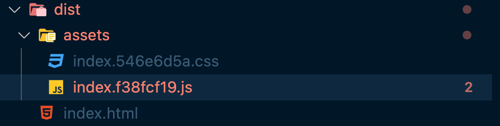

# build 결과물 → bubble.io로 옮기기

- repository를 다운 받고 yarn build 실행

  - dist 폴더에서 번들링된 js파일 확인

    

  - js파일 최하단부에 아래 코드를 복붙합니다. 복붙할 위치는 document.getElementById ~ 바로 위쪽입니다.

    ```jsx
    function uniqueID() {
      return Math.floor(Math.random() * Date.now())
    }

    const wrapperId = `table-${uniqueID()}`
    const wrapper = document.createElement('div')
    wrapper.setAttribute('id', wrapperId)
    instance.canvas.append(wrapper)
    ```

    

  - document.getElementById('app')에서 'app'을 wrapperId로 바꿔줍니다.
    

- bubble.io에서 플러그인을 initialize하는 부분에 번들링 + 수정한 js파일을 복붙합니다. 위치는 initialize하는 function **내부**입니다.

  

- window.postMessage로 초기화하기 위해 플러그인에 action을 정의합니다.

  ```jsx
  // dev test
  window.postMessage({
    key: 'cigro-table',
    payload: {
      metrics_type: 'SALES',
      user_id: '1651800183717x956761776063033100',
      start: '2021-12-05',
      end: '2022-04-05',
      page: 0,
      per_page: 10,
      order_by_col_num: 1,
      sort: 'ASC',
      search_field: '',
      keyword: '',
      env: 'dev',
    },
  })

  // prod test
  window.postMessage({
    key: 'cigro-table',
    payload: {
      metrics_type: 'SALES',
      user_id: '1619163830244x903498739105014900',
      start: '2021-12-05',
      end: '2022-04-05',
      page: 0,
      per_page: 10,
      order_by_col_num: 1,
      sort: 'ASC',
      search_field: '',
      keyword: '',
      env: 'prod',
    },
  })
  ```

  - 이미지

    

  - **prod환경에서는 payload의 property인 user_id 등을 잘 주입해줘야합니다. 일단 테스트할 때는 하드코딩했습니다.**

- Go to test app에서 플러그인을 포함한 앱을 직접 실행하여 정상 동작을 확인합니다.

  - 이미지

    

    
